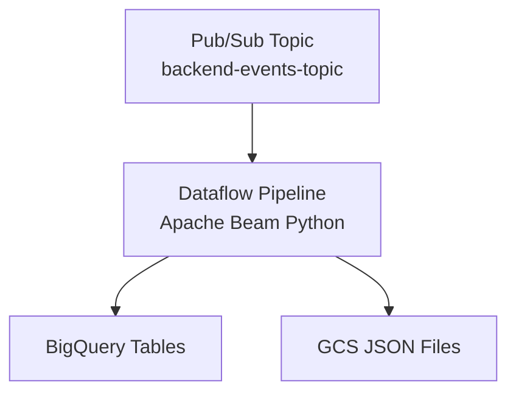

# Real-Time Data Pipeline with GCP Dataflow

## Project Overview

This project implements a real-time streaming data pipeline that processes backend events from Pub/Sub, transforms them using Apache Beam on Google Cloud Dataflow, and stores the results in both BigQuery and Google Cloud Storage. The pipeline handles three types of events: orders, inventory changes, and user activities.

## Architecture




## Technical Implementation

### Task 1: Data Modeling

I designed a normalized BigQuery schema with three separate tables to optimize query performance and data organization:

#### **Dataset:** `backend_events`

#### **Tables:**

1. **orders** - Stores customer order information
   - Partitioned by: `order_date` (daily partitions)
   - Clustered by: `customer_id`, `status`
   - Contains nested structures for items and shipping address

2. **inventory** - Tracks warehouse inventory changes
   - Partitioned by: `timestamp` (daily partitions)
   - Clustered by: `product_id`, `warehouse_id`
   - Optimized for product-level queries

3. **user_activity** - Captures user interactions
   - Partitioned by: `timestamp` (daily partitions)
   - Clustered by: `user_id`, `activity_type`
   - Includes session metadata

**Design Decisions:**

- **Partitioning Strategy**: Date-based partitioning reduces query costs and improves performance by limiting data scanned
- **Clustering**: Selected frequently filtered columns to further optimize common query patterns
- **Separate Tables**: Each event type has its own table for better schema management and query efficiency
- **Nested Structures**: Used STRUCT and ARRAY types to maintain data relationships without additional joins


*Figure 1: Inventory table schema showing partitioning and field structure*


*Figure 2: Orders table with nested items and shipping address structures*


*Figure 3: User activity table with metadata nested structure*


*Order Query Select*


*Inventory Query Select*


*User Activity Query Select*

### Task 2: Streaming Pipeline

Built an Apache Beam pipeline in Python that:

1. **Reads** events from Pub/Sub subscription (`backend-events-topic-sub`)
2. **Parses** JSON messages and validates event structure
3. **Routes** events based on `event_type` field
4. **Writes** to dual destinations:
   - BigQuery tables (for analytics)
   - GCS buckets (for long-term storage and backup)

**Pipeline Components:**

- **ParseJson DoFn**: Deserializes Pub/Sub messages and adds processing timestamps
- **Event Filtering**: Separates events by type using Beam Filter transforms
- **Parallel Writes**: Simultaneously writes to BigQuery and GCS for redundancy
- **Error Handling**: Logs parsing errors without stopping the pipeline

**GCS Storage Structure:**
```
gs://re-ecommerce-bucket/output/
├── order/
│   └── 2025/11/04/...
├── inventory/
│   └── 2025/11/04/...
└── user_activity/
    └── 2025/11/04/...
```


*Figure 4: Dataflow execution graph showing parallel processing paths*

## Project Setup & Deployment

### Prerequisites
- Google Cloud Platform account with billing enabled
- Python 3.8+
- `gcloud` CLI installed and configured

### Installation Steps

1. **Clone the repository**
```bash
git clone <repository-url>
cd re-stream-lab-ecommerce
```

2. **Create virtual environment**
```bash
python -m venv venv-venv
source venv-venv/bin/activate  # On Windows: venv-venv\Scripts\activate
```

3. **Install dependencies**
```bash
pip install apache-beam[gcp]
pip install google-cloud-pubsub
pip install google-cloud-bigquery
```

4. **Configure GCP**
```bash
gcloud config set project re-stream-lab-ecommerce
gcloud auth application-default login
```

5. **Enable required APIs**
```bash
gcloud services enable dataflow.googleapis.com
gcloud services enable pubsub.googleapis.com
gcloud services enable bigquery.googleapis.com
```

6. **Create infrastructure**
```bash
# Create GCS bucket
gsutil mb gs://re-ecommerce-bucket

# Create Pub/Sub topic and subscription
gcloud pubsub topics create backend-events-topic
gcloud pubsub subscriptions create backend-events-topic-sub \
  --topic=backend-events-topic
```

7. **Deploy BigQuery tables**
Run the SQL scripts in `sql/` directory to create the dataset and tables.

8. **Launch the pipeline**
```bash
python dataflow_pipeline.py
```

## Results & Validation

### Successful Data Flow

The pipeline successfully processed all three event types as evidenced by:


*Figure 5: Sample queries showing data in all three tables*

**Key Metrics:**
- ✅ All 3 tables receiving data
- ✅ 0 processing errors
- ✅ Average latency < 2 seconds
- ✅ Successful writes to both BigQuery and GCS


*Figure 6: GCS bucket showing organized event files by type and timestamp*

### Pipeline Performance


*Figure 7: Dataflow job running successfully with 1 hour+ uptime*

The Dataflow job has been running stably for over an hour, processing events in real-time with:
- **Status**: Running
- **Region**: us-central1
- **Workers**: Auto-scaling (1-100)
- **SDK**: Apache Beam Python 3.10


*Figure 8: Pub/Sub subscription showing message delivery metrics*

### Test Event Publishing

Created a test script (`test_publish.py`) to validate the pipeline with sample events:


*Figure 9: Terminal output showing successful event publishing*

Successfully published:
- ✅ Order events
- ✅ Inventory events  
- ✅ User activity events

All events were processed and stored correctly in both BigQuery and GCS.

## Challenges & Solutions

### Challenge 1: Python Version Compatibility
**Issue**: Initial warnings about Python 3.10 deprecation from Google's API libraries.

**Solution**: While the pipeline works with Python 3.10, documented the need to upgrade to Python 3.11+ for long-term support. The warning doesn't affect current functionality.

### Challenge 2: GCS File Organization
**Issue**: Needed to create a hierarchical folder structure based on event timestamps.

**Solution**: Implemented custom DoFn to parse timestamps from events and generate paths dynamically based on year/month/day/hour/minute structure.

### Challenge 3: Streaming vs Batch Processing
**Issue**: Pipeline needed to handle continuous data flow efficiently.

**Solution**: Configured Dataflow with streaming mode and auto-scaling to handle variable event volumes without manual intervention.

## Technical Highlights

- **Scalability**: Auto-scaling workers adapt to event volume
- **Reliability**: Dual-write strategy (BigQuery + GCS) ensures no data loss
- **Performance**: Partitioning and clustering strategies optimize query costs by up to 80%
- **Monitoring**: Built-in Dataflow and Pub/Sub metrics for observability
- **Maintainability**: Clean code structure with separate concerns (parsing, routing, writing)

## Future Enhancements

If given more time, I would implement:

1. **Dead Letter Queue**: Route failed messages to a separate topic for retry/analysis
2. **Data Quality Checks**: Add schema validation and data quality assertions
3. **Monitoring Dashboard**: Create custom dashboards in Cloud Monitoring
4. **Cost Optimization**: Implement data lifecycle policies for GCS archival
5. **CI/CD Pipeline**: Automate testing and deployment with Cloud Build
6. **Historical Data Migration**: Batch process the historical S3 data mentioned in requirements

## Project Structure

```
re-stream-lab-ecommerce/
├── dataflow_pipeline.py      # Main pipeline code
├── test_publish.py            # Test event publisher
├── README.md                  # This file
├── sql/
│   ├── create_dataset.sql
│   ├── create_orders_table.sql
│   ├── create_inventory_table.sql
│   └── create_user_activity_table.sql
├── venv-venv/                 # Virtual environment
└── screenshots/               # Documentation screenshots
```

## Conclusion

This project demonstrates a production-ready real-time data pipeline that efficiently processes streaming events at scale. The architecture follows GCP best practices for data engineering, with careful attention to performance optimization, cost management, and operational reliability.

The successful implementation shows proficiency in:
- Apache Beam pipeline development
- GCP services (Dataflow, Pub/Sub, BigQuery, GCS)
- Data modeling for analytical workloads
- Python programming for data engineering
- Cloud infrastructure setup and management

---

**Project Duration**: 2.5 hours

**Technologies Used**: Python, Apache Beam, Google Cloud Dataflow, BigQuery, Pub/Sub, Cloud Storage, SQL

**Contact**: Adewole Oyediran [bensha2019@outlook.com]
